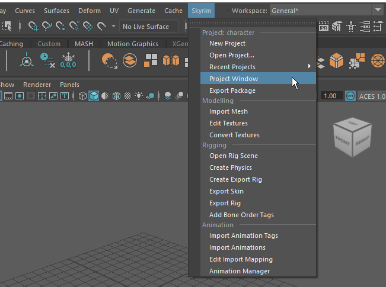

# ckmaya
This project is a collection of Maya animation tools for modding Skyrim.
Under the hood these tools use [ck-cmd](https://github.com/aerisarn/ck-cmd) to convert to and from Skyrim formats.



## Installation
1. Download the entire depot as a .zip file.
2. Move the `ckmaya` directory to your Maya scripts directory. 
3. Either move `scripts\userSetup.py` to your script directory or add the following lines to an existing one:

```
from maya import cmds
cmds.evalDeferred('from ckmaya.ui import menu;menu.addMenuCallback();menu.addSkyrimMenu()')
```
