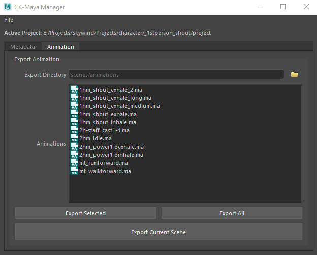

# ckmaya
This project is a custom interface for using [ck-cmd](https://github.com/aerisarn/ck-cmd) inside Autodesk Maya 2022+.



## Installation
1. Download the entire depot as a .zip file.
2. Extract the `ckmaya` directory to your Maya scripts directory. 
4. In Maya the main window can be launched from the newly added Skyrim menu or with the **python** script below:

```
from ckmaya.ui export_manager
export_manager.ExportManager.load()
```
